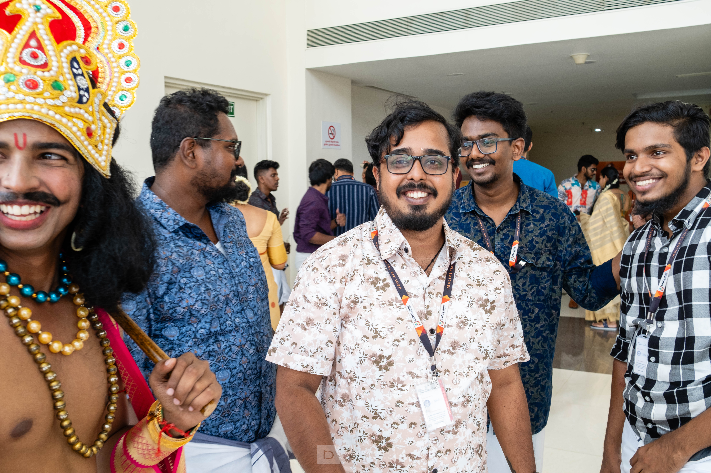

# Welcome to Protfolio

# Vivek H 

## About Me
I am Vivek H, a passionate DevOps Engineer with a strong background in automating, optimizing, and streamlining software development and IT operations. I thrive on solving complex problems and enhancing the efficiency of software delivery pipelines.

## Professional Experience

### ABC Tech Solutions (June 2020 - Present)
- Led the implementation of CI/CD pipelines, resulting in a 30% reduction in deployment time.
- Collaborated with cross-functional teams to ensure smooth release cycles.
- Automated infrastructure provisioning using Terraform and Ansible, improving scalability.

### XYZ Software (January 2018 - May 2020)
- Managed and maintained AWS infrastructure, optimizing costs by 20%.
- Implemented monitoring and alerting solutions for proactive issue resolution.
- Spearheaded containerization efforts with Docker and Kubernetes.

## Skills
- **DevOps Tools:** Jenkins, Git, Docker, Kubernetes, Terraform, Ansible
- **Cloud Platforms:** AWS, Azure
- **Scripting/Programming:** Python, Bash
- **Monitoring:** Prometheus, Grafana

## Projects
1. **CI/CD Pipeline Automation** (2021)
   - Automated the entire CI/CD pipeline, reducing manual intervention by 90%.
   - Technologies used: Jenkins, Docker, Git.

2. **Infrastructure as Code (IaC)** (2019)
   - Implemented IaC principles for infrastructure provisioning and management.
   - Technologies used: Terraform, Ansible.

## Education
- Bachelor of Science in Computer Science, University Name, Graduated in 2017.

## Certifications
- Certified Kubernetes Administrator (CKA)
- AWS Certified DevOps Engineer

## Contact Information
- Email: vivekh.phoenix@gmail.com
- LinkedIn: [linkedin.com/in/vivek-h-2bb99679](https://linkedin.com/in/vivek-h-2bb99679)

Feel free to customize this sample portfolio with your specific experiences, achievements, and details. Including relevant project examples and certifications can make your portfolio more compelling to potential employers.
